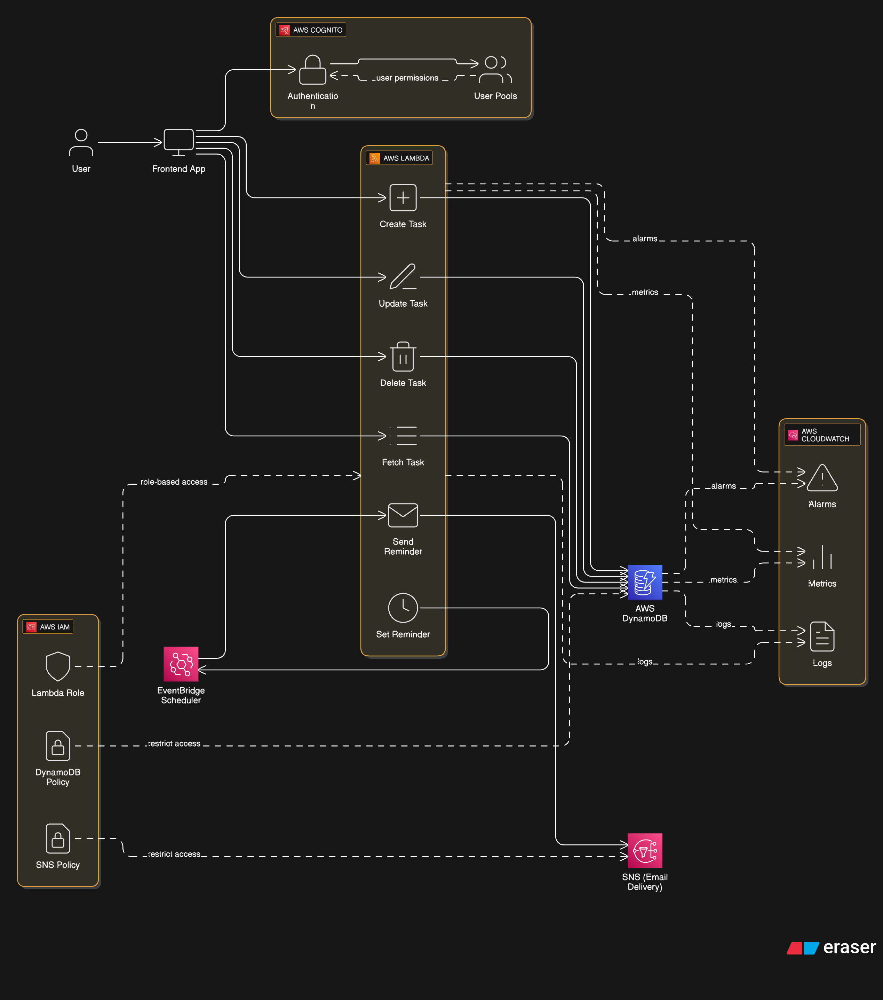

# 📝 Serverless To-Do List Web App (AWS Free Tier)

THis is a full-stack **To-Do List Web App** powered entirely by **AWS Serverless Architecture** — built to stay within the **AWS Always Free Tier** and designed to showcase practical, secure, and scalable cloud development.

## 🔗 Live Demo

👉 [https://simple-to-do.pages.dev/home](https://simple-to-do.pages.dev/home)

## 🧰 Tech Stack

- **Frontend:** React, TypeScript, Vite, Cloudflare Pages
- **Backend:** AWS Lambda, Lambda Function URLs, DynamoDB, Cognito
- **Reminders & Messaging:** EventBridge Scheduler, SNS
- **Monitoring & Security:** CloudWatch, IAM Roles & Policies

  ## 🚀 Features

- Sign up, log in, and manage personal to-dos
- Set **email reminders** for upcoming tasks
- Secure JWT-based authentication via AWS Cognito
- Built entirely using **pay-as-you-go serverless services**
- Frontend deployed on **Cloudflare Pages**
- **Single-table DynamoDB design** with flexible schema
- Real-time reminder scheduling via EventBridge

## 📸 Architecture Overview

> 

## 🚀 Features

* Sign up, log in, and manage personal to-dos
* Set **email reminders** for upcoming tasks
* Built entirely with **pay-as-you-go serverless services**
* Deployed frontend via **Cloudflare Pages**

---

## 🛠️ Core AWS Services & Their Roles

### 1. **Amazon Cognito – User Management & Authentication**

* **Role:** Handles sign-up, login, and JWT token issuance
* **Key Configuration:**

  * **User Pool**: Manages all users
  * **App Client**: Set as public client (no secret), ideal for SPAs

### 2. **AWS Lambda – Serverless Backend Functions**

* **Role:** Executes app logic (CRUD, reminders, notifications)
* **Functions:**

  * `createTaskLambda`, `listTasksLambda`, `updateTaskLambda`, `deleteTaskLambda`
  * `setTaskReminderLambda`, `sendReminderNotificationLambda`

### 3. **Lambda Function URLs – Direct API Endpoints**

* **Role:** Public HTTPS endpoints to invoke each Lambda
* **Security:** AuthType set to `NONE`; JWTs validated **inside** functions
* **CORS:** Configured for Cloudflare Pages & local development

### 4. **Amazon DynamoDB – NoSQL Database**

* **Role:** Stores users and tasks using a **single-table design**
* **Schema:**

  * `PK`: e.g., `USER#<userId>`
  * `SK`: e.g., `TASK#<taskId>`
* Flexible schema enables reminder attributes without altering structure

### 5. **Amazon EventBridge Scheduler – Reminder Engine**

* **Role:** Schedules one-time task reminders
* **Workflow:**

  * Triggers `sendReminderNotificationLambda` at specified time
  * Deletes itself after execution to stay within free tier limits

### 6. **Amazon SNS – Email Notification Delivery**

* **Role:** Sends reminder emails
* **Workflow:**

  * Lambda publishes reminder → SNS → Sends email to confirmed subscribers

### 7. **Amazon CloudWatch – Logging & Monitoring**

* **Role:** Collects logs from all Lambda functions for easy debugging

---

## 🔐 IAM Roles & Policies

### 🔸 `LambdaTodoAppRole` (Worn by Lambda Functions)

* **Permissions:**

  * Full access to specific DynamoDB table
  * CloudWatch Logs access
  * EventBridge Scheduler management
  * SNS publishing

### 🔸 `EventBridgeSchedulerToLambdaRole`

* **Used By:** EventBridge
* **Permission:** Only invoke `sendReminderNotificationLambda`

### 🔸 Lambda Function URL Resource Policies

Each exposed function has a policy allowing public access via HTTPS:

```json
{
  "Effect": "Allow",
  "Principal": "*",
  "Action": "lambda:InvokeFunctionUrl",
  "Condition": {
    "StringEquals": {
      "lambda:FunctionUrlAuthType": "NONE"
    }
  }
}
```

JWT-based auth is handled inside each function.

---

## 🔁 How It Works

### ➕ Creating a Task with a Reminder

1. User logs in via React frontend (Cloudflare Pages)
2. Frontend sends JWT + task data to `setTaskReminderLambda`
3. Lambda:

   * Validates JWT
   * Updates DynamoDB with task & reminder
   * Creates a one-time EventBridge schedule

### ⏰ Sending Reminder Email

1. EventBridge fires at scheduled time
2. Triggers `sendReminderNotificationLambda`
3. Lambda publishes message to `TaskRemindersTopic`
4. SNS sends email to subscribed user

---

## 🌐 Frontend

* Built with **React** + **Vite**
* Hosted on **Cloudflare Pages**
* Authenticates via AWS Cognito
* Communicates with Lambda URLs via HTTPS + JWTs

---

## 💻 Local Development

1. Clone the repo and install frontend dependencies
2. Configure `.env` with AWS environment variables (Cognito IDs, Lambda URLs, etc.)
3. Use tools like Postman or browser for testing Function URLs

---
